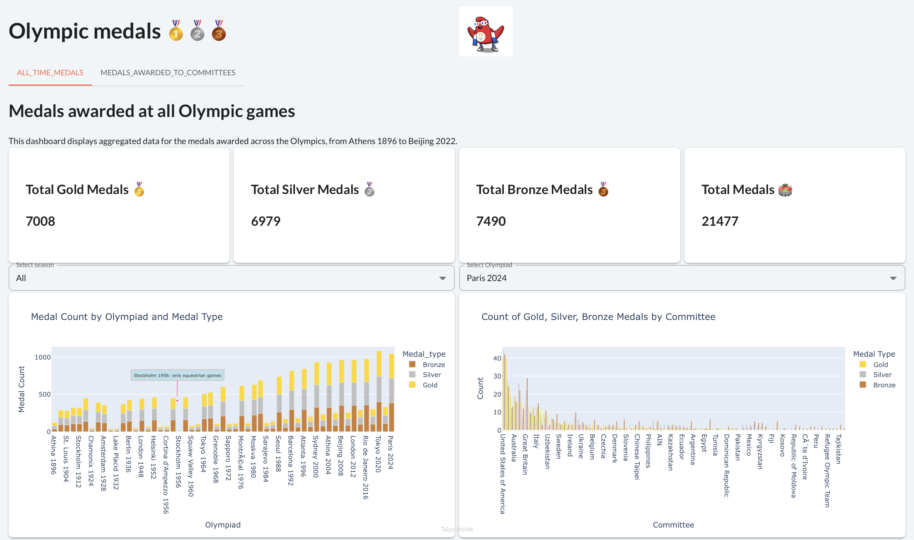

[](https://github.com/psf/black)  
  
  
  

# 🥇🥈🥉 Olympic medals  

## Introduction and context  

Welcome to **Olympic Medals**, a simple Taipy dashboard that shows information about Olympic medals awarded from the beginning of modern Olympic games until the beginning of the year 2024.  

### Recent Updates  
- **Eric Narro** helped me a lot in adapting to this project.  
- I have added the **latest 2024 Paris Olympic dataset**.  
- First, I **cleaned and organized** the dataset to ensure compatibility with the project design and dashboard.  

The dashboard has two tabs:  
- A tab showing aggregated data for all Olympic medals.  
- A second tab focusing on medals won by Olympic committees (countries, but also special committees, such as the Refugee committee).  

The following video presents the dashboard:  

[](https://www.youtube.com/watch?v=_1X7etBFTk0)  

**Context**: This is a demonstration application. It uses **Taipy 3.1**, released a week before writing these lines. Coding this application allowed me to explore the new Pythonic GUI system introduced in Taipy 3.1.  

	I was curious about making a dashboard website, which led me to discover the Taipy library. While exploring it, I came across this project and decided to create a dashboard about the Olympic Games because 2024 is an Olympic year in Paris, and I live in France. Eric Narro played a crucial role in helping me understand how to use Taipy effectively and integrate it into this project:

  

The main change in Taipy 3.1 is how GUI elements are applied. Instead of the previous Markdown-based syntax, it now uses a more **Pythonic function-based system**. This project does **not** use Taipy Core.  

## Features  

- **Multi-Page Dashboard**: Switch between tabs; the application has two pages.  
- **Several types of charts**: Bar charts, sunburst charts, line charts, choropleth maps, and grid charts.  
- **Dynamic Data Updates**: The dashboard dynamically updates data based on the selected year and area type.  
- **Interactive Selectors**: The app includes various types of selectors for user interaction.  

## Getting Started  

### Installation  

Ensure you have the required dependencies installed. You can install them using the following:  

```sh
pip install -r requirements.txt
```
## 📊 Data  

This application uses data from **two CSV files**, available in the `data` repository.  

Both datasets are sourced from Kaggle:  

- **[Olympic medals](./src/data/olympic_medals.csv)** – Contains all medals (**gold, silver, bronze**) awarded at all Olympic Games.  
- **[Olympic cities](./src/data/olympic_cities.csv)** – Includes geographical details of Olympic host cities along with summary information about each Olympic event.  

### 🙌 A Special Thanks to [@enarroied](https://github.com/enarroied) (Eric Narro)  

I sincerely appreciate the support and guidance of **Eric Narro** throughout this project. His expertise and insights helped me **adapt to the new Taipy 3.1 GUI system** and improve the overall structure of the dashboard.  

**Thank you, Eric, for your valuable help!** 🚀👏  